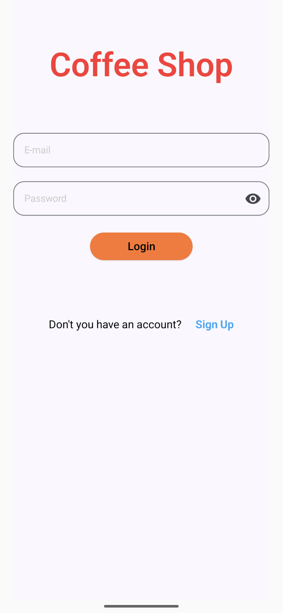
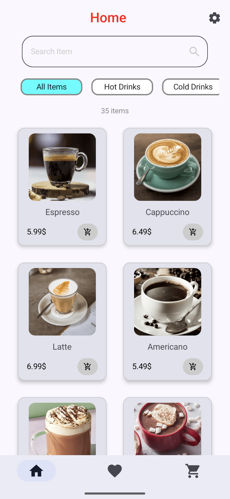
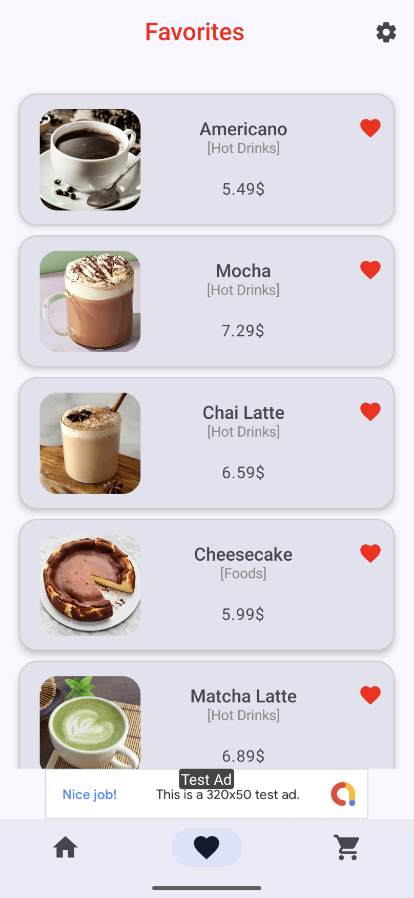
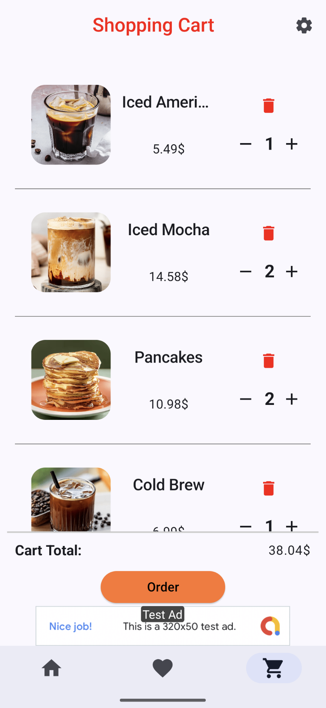
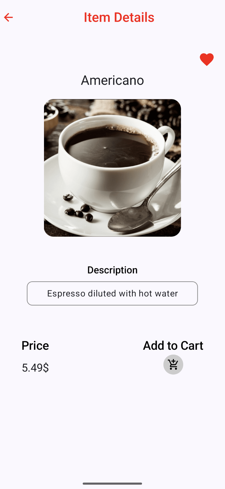
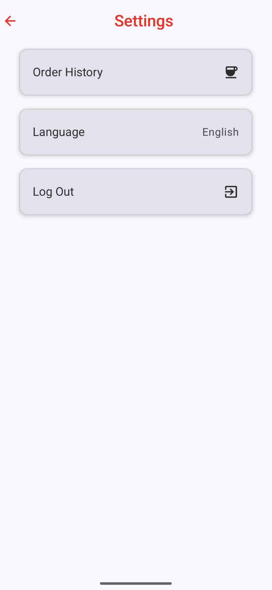
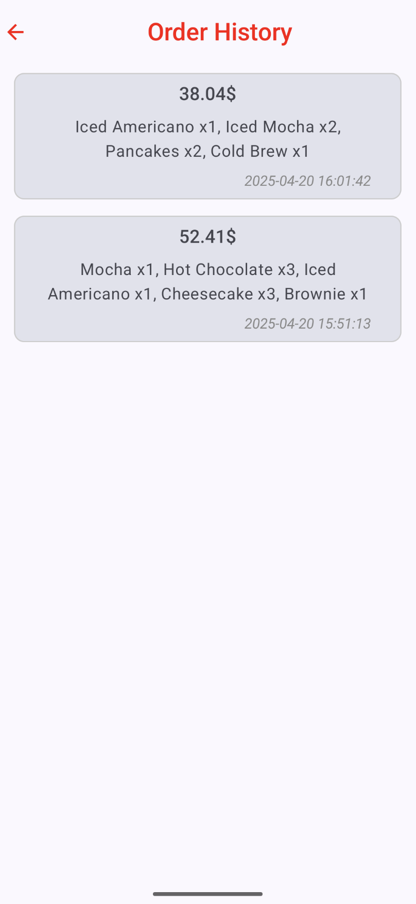
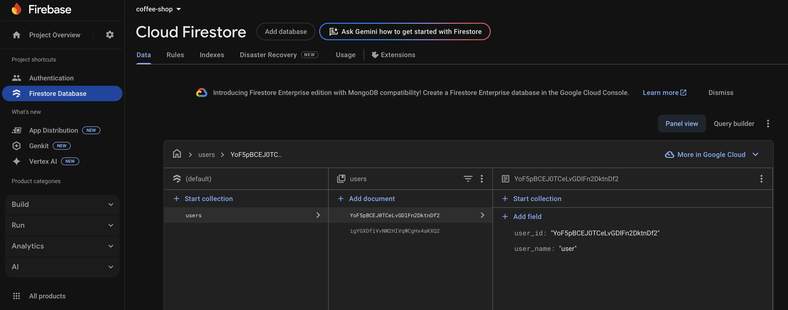
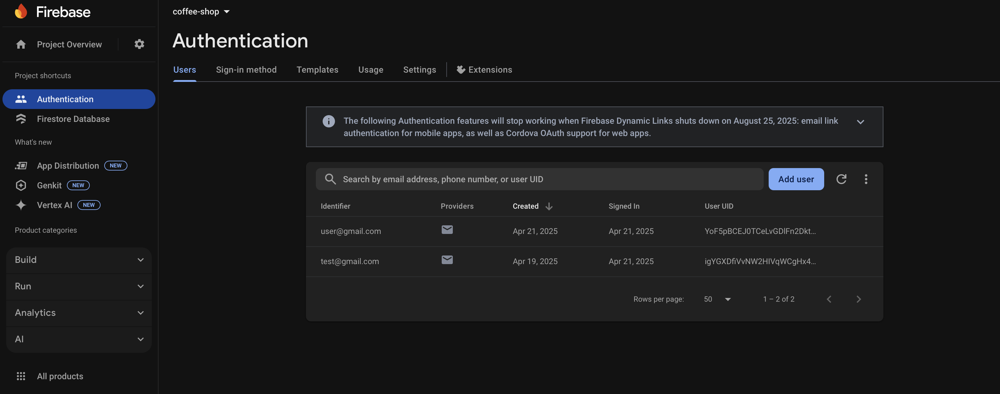

# ☕ Coffee Shop Uygulaması

Kotlin ve Jetpack Compose ile geliştirilmiş, içecek ve yiyecek siparişi deneyimini simüle eden örnek bir mobil uygulama. Kullanıcılar, ürünleri inceleyebilir, favorilere ekleyebilir ve sepetlerine ekleyerek sipariş listesi oluşturabilirler.

## 🚀 Kurulum Adımları

1.Projeyi Klonlayın
- git clone https://github.com/caneralparslan/coffee_shop.git
- veya GitHub üzerinden ZIP olarak indirip çıkarabilirsiniz.

2.Android Studio ile Açın
- Android Studio'yu açın.
- File > Open menüsünden proje klasörünü seçin.

3.Gerekli SDK ve Bağımlılıkları Yükleyin
- Proje açıldıktan sonra Android Studio, ihtiyaç duyulan SDK sürümleri ve Gradle bağımlılıklarını otomatik olarak indirecektir.
- Gerekirse Tools > SDK Manager üzerinden eksik bileşenleri manuel olarak yükleyebilirsiniz.

4.Firebase Yapılandırması
- Eğer Firebase konfigürasyonu ile ilgili bir sorun yaşarsanız , kendi Firebase projenizi oluşturup google-services.json dosyasını app/ klasörüne eklemeniz gerekir.
- Firebase Authentication ve Firestore kullanımı için ilgili servisleri Firebase Console üzerinden etkinleştirin.
5.Uygulamayı Derleyin ve Çalıştırın
- Run > Run 'app' komutu ile uygulamayı bir emülatör veya fiziksel cihazda çalıştırabilirsiniz.
- Gerekli izinleri (internet vb.) verdiğinizden emin olun.

## Temel Özellikler

🔐 1. Kullanıcı Girişi

- Kullanıcı Login ve SignUp işlemleri için FirebaseAuth operasyonları uygulandı.
- Yeni hesap oluştururken ve kullanıcı girişi yapılırken e-posta ve şifre kontrolleri eklendi.
- Aynı zamanda, kullanıcı bilgileri (userId, userName) daha sonra kullanılabilmek üzere Firestore'a kaydedildi.

🏠 2. Ana Ekran

- Kategori Listeleri (Tümü, Sıcak İçecekler, Soğuk İçecekler, Yiyecekler) LazyRow ile gösterildi.
- Seçilen kategori ve/veya aranan query'ye göre ürünler LazyVerticalGrid ile listelendi.
- Bottom NavigationBar ile "Ana Ekran", "Favoriler" ve "Sepet" Ekranları ayarlandı.
- Navigation Bar'ın üzerine Banner Ad yerleştirildi (test reklamı olarak).
- Search Bar'a girilen karakterler ürün isimlerinde aratılarak query değiştikçe filtrelenecek şekilde ayarlandı.
- Her bir ürün görseli, adı, fiyatı ve sepete ekle özelliği ile custom card içerisinde gösterildi.

📦 3. Ürün Modülü

- Gösterilen ürünlere tıklanarak ürün detayları sayfasına yönlendirme yapıldı.
- Ürün detayları sayfasında ürünün ismi, görseli, açıklaması, fiyatı, sepete ekleme, favorilere ekle/çıkar özellikleri sunuldu.

🛒 4. Sepet İşlemleri

- Sepete eklenen ürünlerin görseli, adı, fiyatı, miktar değişikliği özellikleri eklendi.
- Sepetin altında toplam fiyatı gösteren bölüm eklendi.
- Sepet boş değilse sipariş verebilmek için "Sipariş Ver" butonu eklendi ( boşsa ve buton tıklanırsa uyarı mesajı gösterildi ) ve kullanıcının onayına sunuldu.
- Sepette herhangi bir ürün yoksa "action" mesajı gösterildi.
- Onaylanan siparişlerden sonra sepet temizlendi ve sipariş bilgileri sipraiş geçmişi sayfasında gösterilmek üzere kaydedildi.

❤️ 5. Favoriler

- Favoriye eklenen ürünler görseli, adı, kategorisi ve fiyat bilgisi ile listelendi.
- Ürünün favori ikonuna tıklanarak favorilerden kaldırma özelliği eklendi.
- Favorilerde herhangi bir ürün yoksa "action" mesajı gösterildi.

🍩 6. Ürünler

- Ürünler proje içerisinde Dummy data olarak oluşturuldu.
- İsimleri, açıklamaları, fiyatları, kategorileri ayarlandı ve her bir ürüne ait görsel web sitesine yüklendi.

⚙️ 7. Ayarlar Ekranı

- Ayarlar ekranına kullanıcıların Sipariş Geçmişi görüntüleme, Dil Değiştirme, Log Out işlemlerini yapabileceği componentler oluşturuldu. 
- Sipariş Geçmişi sayfasında verilen her siparişin toplam fiyat bilgisi, ürünler ve Timestamp bilgileri gösterildi.
- Dil Değiştirme işlemi için kullanıcıya Alert Dialog gösterildi ve İngilizce - Türkçe olarak değiştirilebilecek şekilde ayarlandı. Tüm uygulamanın dili seçilen dile göre strings.xml dosyasında ayarlanan değerlere göre değiştirilecek şekilde yapıldı.
- Log Out'a tıklandığı zaman kullanıcıya onay diyaloğu sunuldu ve çıkış yapıldığı takdirde FirebaseAuth üzerinden signOut yapıldı ve Login ekranına navigate edildi.

## ⚙️ Teknik Detaylar

🧱 1. Mimari

- MVVM mimarisi kullanılarak UI ile business logic birbirinden ayrı tutuldu.
- Kullanılan tüm bileşenler test edilebilirlik ve okunabilirlik açısından clean Architecture prensiplerine uygun hareket edildi.
- Favorileme, Sepet ve Sipariş Oluşturma işlemleri için Repository'ler oluşturuldu. Bu sayede veri işleme adımları birbirinden ayrı tutularak merkezi bir kontrol mekanizması kuruldu.
- Bottom Navigation ve diğer ekranlar arasında geçişler için ayrı olarak Navigation Controller'lar sağlandı. Bu sayede geçişler için redundancy kaldırıldı.

🧪 2. Teknolojiler

- Uygulama tamamıyla Kotlin ile kodlandı, daha modern ve akıcı bir deneyim için Jetpack Compose kullanıldı.
- Jetpack Compose’un deklaratif fonksiyonları ile tüm arayüz UI elemanlarını verilere bağlamaya gerek duymadan geliştirildi.
- Daha hızlı ve kolay ölçeklenebilirlik, test edilebilirlik, tekrar kullanılabilirlik için Dependency Injection tekniği kullanıldı. Hilt'in otomatik olarak ürettiği Dagger componentleri sayesinde kod karmaşası ortadan kalktı ve proje genelinde daha temiz bir yapı kuruldu.
- Database ve Shared Preferences verilerine asenkron olarak ve main thread'i bloklamadan erişebilmek için Coroutines ve Flow kullanıldı. 
- Bottom Navigation geçişleri için ayrı diğer ekran geçişleri için ayrı olacak şekilde Navigation sistemi kuruldu.
- Ürünlerin görselleri web sitesine yüklendi ve bunları asenkron olarak kullanıcıya göstermek için Coil kütüphanesinin "rememberAsyncImagePainter" fonksiyonu kullanıldı. Bu sayede görseller cache'lendi, loading ve error state'i gözetilerek placeholder olarak CircularProgressIndicator veya Kahve ikonu gösterildi.

🗄️ 3. Depolama

- Kullanıcı bilgilerinin kontrolü ve kaydı için FirebaseAuth ve Firestore kullanıldı.
- Favorileri kontrol etmek için Room kütüphanesi kullanıldı ve bu sayede favorilere eklenen ürünler daha hızlı bir şekilde işlenerek lokale kaydedildi.
- Kullanıcının oluşturduğu alışveriş sepetindeki ürünler uygulama tekrar açıldığında dahi kaybolmaması için SharedPreferences'a kaydedildi. Aynı zamanda geçmiş siparişler de görüntülenebilmesi için Shared'a kaydedildi.

🎨 4. Kullanıcı Arayüzü (UI)

- Kullanıcı deneyimi gözetilerek oluşturan sayfalar ile açıklamaya ihtiyaç duyulmadan gerekli her component ile responsive bir tasarım oluşturuldu.
- Material Design 3 componentlerinin yanı sıra custom olarak birçok component oluşturuldu ve kullanıcının ihtiyaç duyabileceği bilgiler ve fonksiyonlar buralara eklendi.

## APK

[APK](./app/release/app-release.apk)

## Ekran Görüntüleri

    
    
    
    
    
    
    
    
    

## Demo

